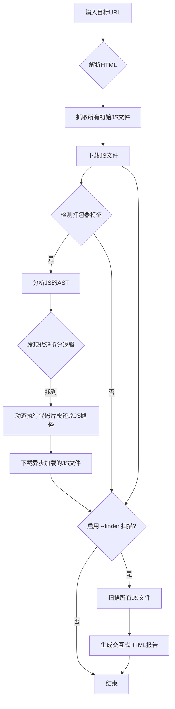

-----

# Packer-InfoFinder - 前端打包器信息探测利器

```
 _____________________
< Packer-InfoFinder >
 _____________________
    \
     \
                                   .::!!!!!!!:.
  .!!!!!:.                        .:!!!!!!!!!!!!
  ~~~~!!!!!!.                 .:!!!!!!!!!UWWW$$$
      :$$NWX!!:           .:!!!!!!XUWW$$$$$$$$$P
      $$$$$##WX!:      .<!!!!UW$$$$"  $$$$$$$$#
      $$$$$  $$$UX   :!!UW$$$$$$$$$   4$$$$$*
      ^$$$B  $$$$\     $$$$$$$$$$$$   d$$R"
        "*$bd$$$$      '*$$$$$$$$$$$o+#"
             """"          """""""
             Packer InfoFinder v1.0
```

[](https://www.google.com/search?q=LICENSE)
[](https://www.python.org/)
[](https://www.google.com/search?q=)

`Packer-InfoFinder` 是一款专为现代Web应用设计的自动化安全扫描工具。它能深度抓取目标网站的JavaScript文件，智能还原由Webpack等打包器进行代码拆分（Code Splitting）的异步模块，并利用强大的正则引擎扫描所有JS代码，发现其中可能存在的敏感信息，如API密钥、内部路径、凭证、个人身份信息（PII）等。

加入工具交流群


## Star History

[](https://www.star-history.com/#TFour123/Packer-InfoFinder&Date)


## 致谢 (Acknowledgments)

本项目是在优秀的开源工具 **[Packer-Fuzzer](https://github.com/rtcatc/Packer-Fuzzer)** 的基础上进行的二次开发。

作者 **风岚sec\_TFour**  、 **eonun** 


感谢名单

**muxue**

`Packer-InfoFinder` 继承了 `Packer-Fuzzer` 强大的Webpack代码拆分还原能力，并在此之上，重点增强了以下功能：

  * **深度敏感信息扫描引擎 (`--finder`)**: 新增了全面的敏感信息正则检测能力。
  * **现代化交互式报告**: 全面重构了报告系统，提供了聚合式的总览报告和功能更丰富的单个目标报告。

## 核心功能

  * **🚀 自动化的JS文件深度抓取**: 全面解析HTML，自动抓取并下载所有外链及内联的JavaScript文件。
  * **🧠 智能Webpack代码拆分还原**: 核心亮点功能。通过 **AST（抽象语法树）分析** 和 **动态JS代码片段执行（Deno VM）**，精准还原并下载由`import()`等语法动态加载的异步JS模块，挖掘隐藏更深的代码资产。
  * **🛡️ 强大的敏感信息扫描引擎**: 内置丰富的、经过优化的正则表达式规则库，专门用于检测各类前端代码中可能泄露的敏感数据。
  * **📊 交互式和人性化的HTML报告**:
      * 对单个目标生成详细的、带侧边栏导航和过滤功能的扫描报告。
      * 在批量扫描模式下，生成一个**聚合式总览报告**，您可以在一个页面内快速概览所有目标的扫描结果，并**点击展开**查看任意目标的详细发现，无需跳转。
  * **⚙️ 高度可配置**: 支持设置代理、自定义Cookie和HTTP头，适应各种复杂的测试环境。

## 工作流示意图



## 安装

1.  克隆本项目到本地:

    ```bash
    git clone https://github.com/TFour123/Packer-InfoFinder.git
    cd Packer-InfoFinder
    ```

2.  安装所需的Python依赖库:

    ```bash
    pip install -r requirements.txt
    ```

    `requirements.txt` 文件内容如下:

    ```text
    requests
    beautifulsoup4
    deno-vm
    esprima
    ```
	
	
3.安装deno

		win主机使用powershell使用命令安装 irm https://deno.land/install.ps1 | iex
	    mac主机 brew install deno  安装deno

!!!!!!注: win主机运行cmd使用管理员权限运行，mac主机默认即可。

## 使用说明

### 参数概览

```
-u, --url       目标URL
-l, --list      包含多个URL的目标文件
-c, --cookie    网站Cookie
-p, --proxy     代理地址 (例如: http://127.0.0.1:8080)
-d, --head      额外的HTTP头 (例如: 'X-Forwarded-For:127.0.0.1')
--finder        [重要] 启用JavaScript敏感信息扫描功能
-s, --silent    静默模式，只输出关键信息
```

### 使用示例

1.  **对单个目标进行JS文件抓取和Webpack还原**:

    ```bash
    python Packer-InfoFinder.py -u "https://target.com"
    ```

2.  **对单个目标进行完整扫描（包含敏感信息发现）**:
    这是最常用的模式。扫描完成后，将在 `tmp/` 目录下生成 `finder_results` 文件夹，内含详细的 `sensitive_info.html` 报告。

    ```bash
    python Packer-InfoFinder.py -u "https://target.com" --finder
    ```

3.  **批量扫描多个目标（推荐）**:
    从 `targets.txt` 文件中读取所有URL，并对每个URL进行完整的敏感信息扫描。最终会在项目根目录下生成一份名为 `Finder_敏感信息总览报告.html` 的聚合报告。

    ```bash
    # targets.txt:
    # https://target1.com
    # https://target2.com
    # ...

    python Packer-InfoFinder.py -l targets.txt --finder
    ```

4.  **使用代理和Cookie进行扫描**:

    ```bash
    python Packer-InfoFinder.py -u "https://internal-site.com" --finder -p "http://127.0.0.1:8080" -c "sessionid=xxxxxx"
    ```

## 特色功能详解

### 1\. Webpack异步模块还原

现代前端框架（如Vue, React）广泛使用Webpack的**代码拆分**（Code Splitting）技术来优化性能，即仅在需要时才通过网络请求加载对应的JS模块。这导致简单的爬虫无法获取网站的全部前端代码。

`Packer-InfoFinder`通过以下步骤解决此问题：

  * **AST解析**: 使用`esprima`库将JS代码解析为抽象语法树。
  * **模式识别**: 遍历AST，精确识别出负责动态加载模块的代码模式（例如 `__webpack_require__.e` 或类似函数）。
  * **安全执行**: 将识别出的代码片段和相关的模块ID放入一个安全的`deno_vm`沙箱环境中执行，动态计算出被混淆或拼接而成的真实JS文件名。
  * **增量下载**: 将新发现的JS文件加入下载队列，并重复此过程，直至没有新的异步模块被发现。

### 2\. 敏感信息扫描与报告

当启用 `--finder` 标志时，工具会对所有下载的JS代码（包括异步加载的模块）进行正则匹配。

**扫描覆盖范围**:

  * **云服务密钥**: Aliyun OSS AccessKey 等。
  * **API密钥与Token**: JWT (JSON Web Tokens), GitHub Token, Slack Token 等。
  * **凭证信息**: Basic Auth, 数据库连接字符串中的用户名密码。
  * **个人身份信息 (PII)**: 国内手机号码、身份证号码。
  * **内部信息**: 内部IP地址、敏感的配置变量名（secret, token, auth）。
  * **潜在的路径泄露**: 代码中硬编码的URL和API路径。

**报告系统**:

#### 总览报告 (`Finder_敏感信息总览报告.html`)

在批量扫描模式下生成，是您工作的起点。

  * **清晰概览**: 每个目标一行，包含URL、结果摘要和原始报告链接。
  * **快速定位**: 摘要部分会用红色高亮显示发现敏感信息的目标。
  * **交互式展开**: 点击任意一行，**无需离开当前页面**，即可在下方展开一个包含该目标所有详细发现的视图。视图内有Tab页分类，并能在上下文中高亮匹配项。

#### 单个目标详细报告 (`sensitive_info.html`)

  * **分类导航**: 左侧侧边栏按敏感信息类型分类，并显示每个分类的发现数量。
  * **多视图切换**: 支持在“卡片视图”和“表格视图”之间切换，满足不同浏览习惯。
  * **全文搜索与过滤**: 快速在所有发现中搜索关键词。
  * **上下文展示**: 每个发现都提供其在原始JS文件中的上下文，并高亮匹配的敏感内容，方便您快速定位和验证。

## 贡献

欢迎您为此项目做出贡献！如果您有新的想法、发现了bug或想要添加更强大的扫描规则，请随时提交 Pull Request 或创建 Issue。

## 免责声明

本工具仅限于授权的安全测试和教育目的。用户应对其所有行为负责。在使用本工具进行任何扫描之前，请确保您已获得目标系统的明确许可。开发者不承担任何因滥用本工具而导致的法律责任。
